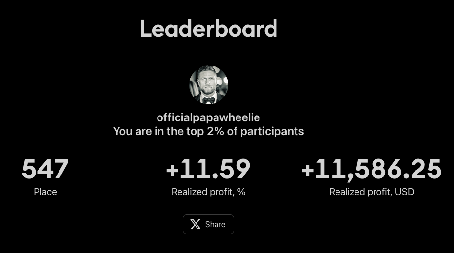

# Day 4 Results



> All trades below were executed using Credexium signals. Public access coming soon! For live updates, follow [@mrpapawheelie](https://x.com/mrpapawheelie) on X.

<br/>

<!-- Full-width table using HTML for better display -->
<table style="width:100%; text-align:center;">
  <thead>
    <tr>
      <th>Trade #</th>
      <th>Symbol</th>
      <th>Direction</th>
      <th>Entry Price</th>
      <th>Exit Price</th>
      <th>PnL (USD)</th>
    </tr>
  </thead>
  <tbody>
    <tr><td>1</td><td>COMEX:GC1!</td><td>Short</td><td>3374.80</td><td>3350.10</td><td>+2,470.00</td></tr>
    <tr><td>2</td><td>COMEX_MINI:MGC1!</td><td>Short</td><td>3375.00</td><td>3351.40</td><td>+472.00</td></tr>
    <tr><td>3</td><td>CME_MINI:ES1!</td><td>Long</td><td>5955.00</td><td>5973.75</td><td>+937.50</td></tr>
    <tr><td>4</td><td>CBOT_MINI:YM1!</td><td>Long</td><td>42480.00</td><td>42477.00</td><td>-15.00</td></tr>
    <tr><td>5</td><td>CME_MINI:MNQ1!</td><td>Long</td><td>21747.75</td><td>21858.25</td><td>+221.00</td></tr>
    <tr><td>6</td><td>CBOT_MINI:MYM1!</td><td>Long</td><td>42469.00</td><td>42727.00</td><td>+129.00</td></tr>
    <tr><td>7</td><td>CME_MINI:ES1!</td><td>Long</td><td>5975.25</td><td>5993.75</td><td>+925.00</td></tr>
    <tr><td>8</td><td>NYMEX:CL1!</td><td>Long</td><td>62.71</td><td>62.92</td><td>+210.00</td></tr>
    <tr><td>9</td><td>NYMEX:CL1!</td><td>Short</td><td>63.42</td><td>62.39</td><td>+1,030.00</td></tr>
    <tr><td>10</td><td>NYMEX:MCL1!</td><td>Short</td><td>63.36</td><td>62.61</td><td>+750.00</td></tr>
    <tr><td>11</td><td>CME_MINI:MNQ1!</td><td>Long</td><td>21742.25</td><td>21716.00</td><td>-52.50</td></tr>
    <tr><td>12</td><td>CME_MINI:ES1!</td><td>Long</td><td>5987.75</td><td>5994.00</td><td>+312.50</td></tr>
    <tr><td>13</td><td>CME:MBT1!</td><td>Short</td><td>106880.00</td><td>106785.00</td><td>+47.50</td></tr>
    <tr><td>14</td><td>CME:MBT1!</td><td>Long</td><td>106620.00</td><td>106950.00</td><td>+165.00</td></tr>
    <tr><td>15</td><td>CME:MET1!</td><td>Long</td><td>2635.00</td><td>2636.50</td><td>+33.75</td></tr>
    <tr><td>16</td><td>COMEX_MINI:MGC1!</td><td>Long</td><td>3395.90</td><td>3409.50</td><td>+272.00</td></tr>
    <tr><td>17</td><td>CME:MBT1!</td><td>Long</td><td>104725.00</td><td>105735.00</td><td>+505.00</td></tr>
    <tr><td>18</td><td>CME:MET1!</td><td>Long</td><td>2561.00</td><td>2584.00</td><td>+517.50</td></tr>
    <tr><td>19</td><td>COMEX:GC1!</td><td>Long</td><td>3396.90</td><td>3409.50</td><td>+1,260.00</td></tr>
    <tr><td>20</td><td>CME_MINI:ES1!</td><td>Long</td><td>5915.50</td><td>5945.50</td><td>+1,500.00</td></tr>
    <tr><td>21</td><td>CME_MINI:MNQ1!</td><td>Long</td><td>21419.50</td><td>21535.75</td><td>+232.50</td></tr>
  </tbody>
</table>

<br/>

---

## Raw Trade Log

```
// The raw trade log is shown below for transparency.
// ...
